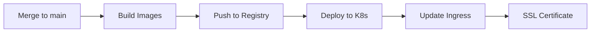

# 🥟 Momo Store - Пельменная №2


Vue.js фронтенд и Go бэкенд приложение для интернет-магазина пельменей, развернутое в Kubernetes кластере Yandex Cloud.

## 🚀 CI/CD Pipeline

### 📋 Стадии пайплайна

| Стадия | Описание | Инструменты |
|--------|-----------|-------------|
| **build** | Сборка Go приложения | Go 1.17 |
| **test** | Unit-тесты и статический анализ | SonarQube |
| **docker-build** | Сборка Docker образов | Docker, Kaniko |
| **release** | Тегирование в GitLab Registry | GitLab Registry |
| **deploy** | Деплой в Kubernetes | kubectl, Helm |

### 🏷️ Версионирование

Версии образов формируются автоматически по шаблону:

```bash

1.0.${CI_PIPELINE_ID}  # Пример: 1.0.7496502
**Хранилище образов**: GitLab Container Registry
- `gitlab.praktikum-services.ru:5050/std-int-005-013/varenikilife/momo-backend:1.0.7496502`
- `gitlab.praktikum-services.ru:5050/std-int-005-013/varenikilife/momo-frontend:latest`

## 📊 Качество кода

### 🔍 Backend тестирование

Настроен статический анализ через **SonarQube**:

```bash
sonar-scanner \
  -Dsonar.projectKey="std-int-005-013_varenikilife_AZoVXruJB0vRiJmVN070" \
  -Dsonar.sources="." \
  -Dsonar.host.url="https://sonarqube.praktikum-services.ru" \
  -Dsonar.login="${SONAR_TOKEN}"
```

**Проверяемые метрики:**
- ✅ Code coverage
- ✅ Code smells  
- ✅ Security vulnerabilities
- ✅ Bugs
- ✅ Technical debt

## ☸️ Kubernetes Deployment

### 🤖 Автоматический деплой

При мерже в ветку `main` автоматически происходит:



### 🏗️ Архитектура в k8s

| Компонент | Технология | Назначение |
|-----------|------------|------------|
| **Frontend** | Vue.js + nginx | SPA приложение |
| **Backend** | Go API | Бизнес-логика |
| **Ingress** | nginx controller | Маршрутизация + SSL |
| **Services** | ClusterIP | Внутренняя коммуникация |

### 🔐 Сертификаты SSL

HTTPS сертификаты управляются через **Yandex Cloud Certificate Manager**:

- **Домен**: `пельменнососисочныйдомен.рф`
- **Провайдер**: Let's Encrypt
- **Продление**: Автоматическое
- **Termination**: На ingress уровне

## 🛠️ Локальная разработка

### Backend
```bash
cd backend
go run cmd/api/main.go
```

### Frontend
```bash
cd frontend
npm run serve
```

### Docker сборка
```bash
# Backend
docker build -t momo-backend:latest -f backend/Dockerfile .

# Frontend  
docker build -t momo-frontend:latest -f frontend/Dockerfile .
```

## 🌐 Production доступ

| Ресурс | URL |
|--------|-----|
| **Основной сайт** | https://пельменнососисочныйдомен.рф |
| **API** | https://пельменнососисочныйдомен.рф/api |
| **Kubernetes Dashboard** | `kubectl get all -n default` |

## 📁 Структура проекта

```
momo-store/
├── backend/                 # Go бэкенд
│   ├── cmd/api/            # Точка входа
│   ├── pkg/                # Внутренние пакеты
│   └── Dockerfile          # Docker образ
├── frontend/               # Vue.js фронтенд
│   ├── public_html/        # Статика
│   └── Dockerfile          # Docker образ  
├── k8s/                    # Kubernetes манифесты
│   ├── backend/            # Backend ресурсы
│   ├── frontend/           # Frontend ресурсы
│   └── ingress.yaml        # Ingress конфигурация
├── .gitlab-ci.yml          # CI/CD конфигурация
└── README.md              # Документация
```

## 🔑 Переменные окружения GitLab

| Переменная | Назначение |
|------------|-------------|
| `KUBE_CONFIG` | kubeconfig для доступа к кластеру |
| `SONAR_TOKEN` | токен для SonarQube |
| `CI_REGISTRY_USER` | логин для GitLab Registry |
| `CI_REGISTRY_PASSWORD` | пароль для GitLab Registry |

---

**Статус**: Production 🟢  
**Последний деплой**: `${CI_PIPELINE_CREATED_AT}`

---

<div align="center">

*Разработано с ❤️ для любителей пельменей*

</div>
```

Этот README будет красиво отображаться в GitLab с:
- Бейджами технологий
- Таблицами
- Mermaid-диаграммой
- Структурой кода
- Четким форматированием

Хотите добавить какие-то дополнительные разделы?